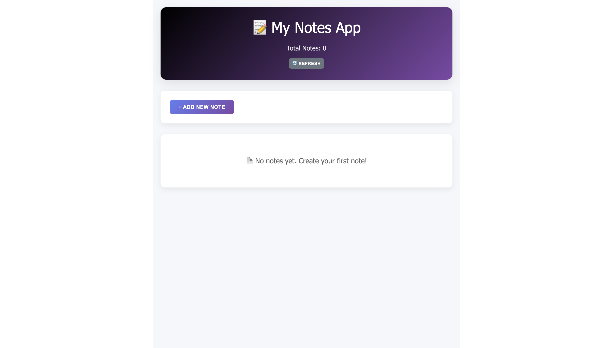
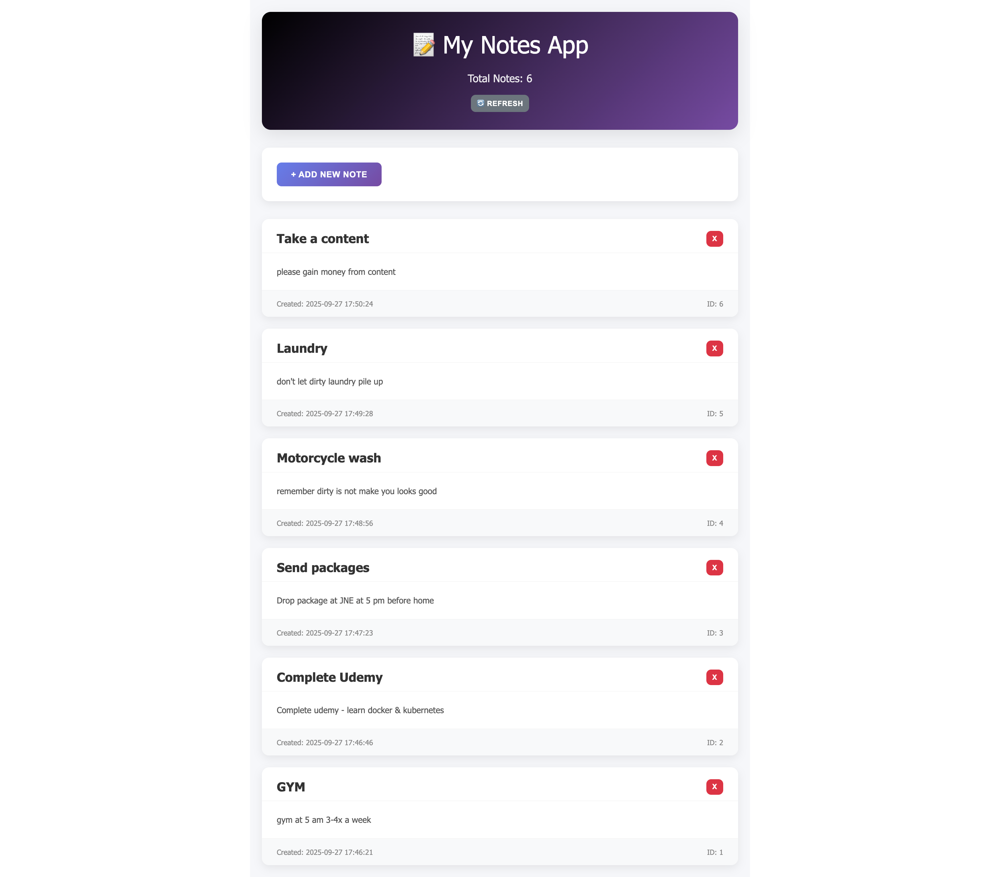

# My Notes App

Develop by @author Daniel Buala Kristo Zalukhu based on @author stevelyall base project

Example of a simple notes app built with Angular.
Notes are retrieved from and sent to the REST API backend. 

## Features:
* View a list of all notes
* Create new notes, with a title and content

## Validation rules:
* Title has a max length of 255 characters
* Note content has a max length of 1024 characters
 
## Requirements:
* [Astrapay My Simple Note Application](https://github.com/danielzalukhu/astrapay-spring-boot-external.git) Running at http://localhost:8000/
* mvn spring-boot:run

Tested in Chrome 67 on OSX. 

## Install dependencies

Run `npm install` to install the project's dependencies before running. 

## Development server

Run `npm start` for a local dev server. 
It can be accessed at http://localhost:4200/.

## Documentation

### View Notes

##### View Notes

##### List of Notes

